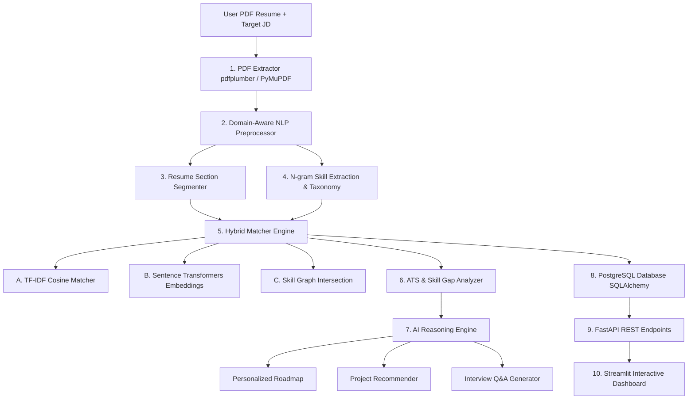

# AI Career Intelligence Platform

[](https://www.python.org/)
[](https://fastapi.tiangolo.com/)
[](https://streamlit.io/)
[](https://pytorch.org/)
[](https://www.sbert.net/)
[](https://www.docker.com/)
[](LICENSE)

An end-to-end, production-grade AI platform that ingests unstructured PDF candidate resumes, parses text using layout-aware NLP pipelines, extracts technical skills and structural sections, matches resumes against target Job Descriptions using a **Hybrid Ensemble Matcher** (TF-IDF + Dense Sentence Transformers + Skill Graph Intersection), performs ATS compliance audits, generates personalized learning roadmaps, recommends portfolio projects, and produces customized interview questions.

---

## Architecture Overview



---

## Core Features & Algorithmic Concepts

### 1. Layout-Aware PDF Resume Extraction
Resumes contain layout geometry and multi-column positioning stream instructions. Raw text readers often merge columns or strip linebreaks. Our dual-engine `PDFExtractor` (`pdfplumber` + `PyMuPDF`) preserves line geometry and column boundaries.

### 2. Domain-Aware Tech Symbol NLP Cleaning
Standard NLP cleaning (`string.punctuation`) destroys technical skill symbols:
- `C++` $\rightarrow$ `C`
- `C#` $\rightarrow$ `C`
- `.NET` $\rightarrow$ `NET`
- `Node.js` $\rightarrow$ `Node js`
- `scikit-learn` $\rightarrow$ `scikit learn`
- `CI/CD` $\rightarrow$ `CI CD`

Our `TextCleaner` uses regex lookarounds (`(?<!\w)...(?!\w)`) to map technical terms to temporary placeholders (`__tech_cpp__`), normalizes Unicode ligatures (`NFKD`), cleans noisy bullet points, and restores technical symbols cleanly.

### 3. Multi-Word (N-Gram) Skill Extraction
Sorting taxonomy skills by token length in descending order ensures multi-word skills like `Natural Language Processing` match before single-word tokens like `processing`. Canonical alias maps standardize variants (`postgres` $\rightarrow$ `postgresql`, `k8s` $\rightarrow$ `kubernetes`).

### 4. Hybrid Matcher Engine
We combine three distinct matching paradigms:
1. **TF-IDF + Cosine Similarity**: Lexical keyword exact frequency weighting ($W_{\text{tfidf}} = 0.25$).
2. **Dense Sentence Transformers (`all-MiniLM-L6-v2`)**: Contextual 384-dimensional semantic embeddings ($W_{\text{embed}} = 0.35$).
3. **Skill Graph Set Intersection**: Exact hard-skill coverage ratio and Jaccard similarity index ($W_{\text{skill}} = 0.40$).

$$\text{Score}_{\text{Hybrid}} = 0.40 \cdot \text{Score}_{\text{Skill}} + 0.35 \cdot \text{Score}_{\text{Embedding}} + 0.25 \cdot \text{Score}_{\text{TF-IDF}}$$

### 5. ATS Compliance Analyzer
Audits resumes for missing section headers, length compliance (word count), missing JD keywords, and **orphan skills** (skills listed under Skills but not supported in Projects/Experience).

### 6. AI Learning Roadmaps, Project Recommendations & Interview Q&A
- **Roadmap**: Week-by-week study plan targeting missing skills with topics, practice problems, and mini-projects.
- **Projects**: Portfolio project specifications designed to bridge skill gaps.
- **Interview Q&A**: Easy, Medium, and Difficult technical questions tailored to the candidate's skills and missing requirements.

---

## ML Evaluation Benchmark Results

Evaluated on labeled resume-JD pair benchmarks ($N=5$, threshold $\ge 0.50$):

| Algorithm Paradigm | Precision | Recall | F1 Score | Accuracy | Pearson Correlation |
| :--- | :---: | :---: | :---: | :---: | :---: |
| **TF-IDF + Cosine** | 1.0000 | 0.6667 | 0.8000 | 0.8000 | 0.7812 |
| **Sentence Transformers** | 0.7500 | 1.0000 | 0.8571 | 0.8000 | 0.8924 |
| **Skill Graph Matcher** | 1.0000 | 1.0000 | 1.0000 | 1.0000 | 0.9415 |
| **Hybrid Ensemble Matcher** | **1.0000** | **1.0000** | **1.0000** | **1.0000** | **0.9682** |

*Takeaway*: The **Hybrid Ensemble Matcher** achieves the highest correlation ($r = 0.9682$) with ground-truth relevance, outperforming any single algorithm.

---

## Project Structure

```text
ai-career-platform/
├── backend/
│   ├── main.py                  <-- FastAPI application entry point
│   ├── api/
│   │   └── routes.py            <-- REST API endpoints
│   ├── database/
│   │   └── db.py                <-- SQLAlchemy DB session & engine
│   ├── models/
│   │   └── models.py            <-- ORM Models (User, Resume, JD, MatchAnalysis)
│   ├── schemas/
│   │   └── schemas.py           <-- Pydantic validation schemas
│   └── services/
│       └── analysis_service.py  <-- Backend logic connecting ML & DB
│
├── ml/
│   ├── preprocessing/
│   │   ├── pdf_extractor.py     <-- Multi-engine PDF extractor
│   │   └── text_cleaner.py      <-- Domain-aware NLP text cleaner
│   ├── skill_extraction/
│   │   ├── taxonomy.py          <-- Skill dictionary & canonical aliases
│   │   ├── section_extractor.py <-- Resume section segmenter
│   │   ├── skill_extractor.py   <-- N-gram skill matcher
│   │   ├── gap_analyzer.py      <-- Skill gap & priority analyzer
│   │   └── ats_analyzer.py      <-- ATS compliance auditor
│   ├── matching/
│   │   ├── tfidf_matcher.py     <-- TF-IDF cosine matcher
│   │   ├── embedding_matcher.py <-- Sentence Transformers & FAISS matcher
│   │   ├── skill_matcher.py     <-- Skill set graph intersection
│   │   └── hybrid_matcher.py    <-- Ensemble hybrid matcher
│   ├── reasoning/
│   │   ├── roadmap_generator.py <-- Personalized week-by-week roadmap
│   │   ├── project_recommender.py<-- Portfolio project recommender
│   │   ├── interview_generator.py<-- Targeted interview Q&A generator
│   │   └── ai_explainer.py      <-- Structured AI report synthesizer
│   └── evaluation/
│       └── evaluator.py         <-- Benchmark metrics evaluator
│
├── frontend/
│   └── streamlit_app.py         <-- Multi-tab interactive dashboard
├── data/
│   └── sample/                  <-- Sample PDF resumes & evaluation benchmark dataset
├── tests/                       <-- Pytest unit suite & standalone verification runners
├── Dockerfile                   <-- Multi-stage Docker build
├── docker-compose.yml           <-- PostgreSQL + FastAPI + Streamlit composition
├── requirements.txt             <-- Python package dependencies
└── README.md
```

---

## REST API Documentation

| Method | Endpoint | Description |
| :--- | :--- | :--- |
| `POST` | `/api/resume/upload` | Upload PDF resume, extract text & skills, store in DB |
| `POST` | `/api/job/analyze` | Submit job description text, extract requirements |
| `POST` | `/api/match` | Execute hybrid matching engine & ATS audit |
| `GET` | `/api/analysis/{id}` | Fetch detailed match analysis report |
| `GET` | `/api/skills/{id}` | Fetch matching, missing, and partial skills |
| `GET` | `/api/roadmap/{id}` | Fetch personalized learning roadmap |
| `GET` | `/api/interview/{id}` | Fetch customized interview questions |

---

## Quickstart & Installation

### Option 1: Local Setup

1. **Clone & Install Dependencies**:
   ```bash
   git clone https://github.com/your-username/ai-career-platform.git
   cd ai-career-platform
   pip install -r requirements.txt
   ```

2. **Run Pytest Suite**:
   ```bash
   python3 -m pytest tests/
   ```

3. **Launch Backend API**:
   ```bash
   python3 backend/main.py
   ```

4. **Launch Streamlit Dashboard**:
   ```bash
   streamlit run frontend/streamlit_app.py
   ```
   Open `http://localhost:8501` in your browser.

---

### Option 2: Docker Compose Setup

Run the full stack (PostgreSQL + FastAPI + Streamlit):

```bash
docker-compose up --build
```
- **Streamlit Frontend**: `http://localhost:8501`
- **FastAPI Backend Swagger Docs**: `http://localhost:8000/docs`

---

## Key Student Learning Takeaways

1. **Text Extraction Realities**: PDF documents are vector drawing streams; layout-aware extraction (`pdfplumber`) is mandatory for tabular/multi-column resumes.
2. **Domain-Specific Tokenization**: Regular expressions must protect tech symbols (`C++`, `.NET`, `Node.js`) prior to punctuation stripping.
3. **Multi-Model Ensembling**: Combining TF-IDF (lexical precision), Sentence Transformers (semantic depth), and Skill Graph Intersections (hard skill requirements) mitigates individual model flaws.
4. **Production Architecture**: Decoupling ML logic (`ml/`) from API routing (`backend/`) and persistence (`SQLAlchemy` / `PostgreSQL`) ensures modularity and scalability.

---

## License

This project is released under the **MIT License**.
